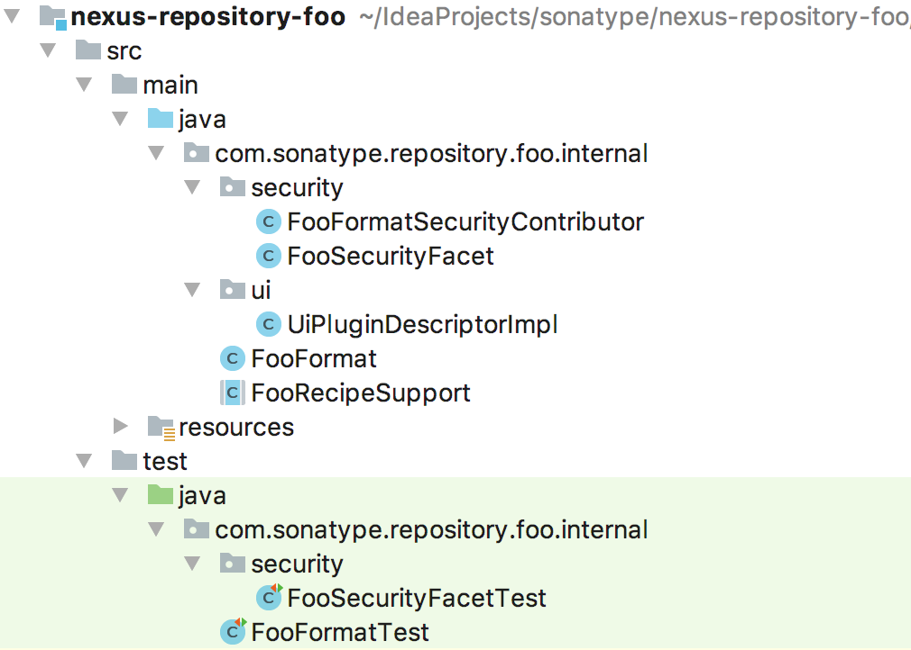

# Developing a Plugin for a new Format [WIP]

This guide provides an introduction on developing a plugin to add support for a new format to Nexus Repository Manager 3. 
It will give you a quick introduction into coding a format. It won't cover the nitty gritty of how to reverse engineer a format.

:toc: macro
:toc-title:
:toclevels: 99

# What you'll build

You'll build a simple plugin with support for Proxy, Hosted and Group repositories. More information about the different repository types is 
[here](https://help.sonatype.com/display/NXRM3/Repository+Management).

# Useful resources

- [Nexus help](https://help.sonatype.com)
- [Supported formats](https://help.sonatype.com/display/NXRM3M/Supported+Formats)
- [Nexus exchange](http://exchange.sonatype.com/list)

# Creating a project skeleton

First create a new plugin project. The simplest way is to use the format-plugin archetype.

## Clone and build the archetype

1. Clone nexus-format-archetype ```git clone https://github.com/sonatype-nexus-community/nexus-format-archetype```.
2. Change directory to nexus-format-archetype ```cd nexus-format-archetype```.
3. Build the archetype ``` mvn clean install ```.
4. Change directory to a folder where you want the new plugin to live ```cd ../nexus-repository-foo```.
5. Generate the new plugin setting the following parameters to match the new format. 
(See [Archetype GitHub Repository](https://github.com/sonatype-nexus-community/nexus-format-archetype) for more information).

  ``` 
    mvn archetype:generate                              
    -DarchetypeArtifactId=format-plugin               
    -DarchetypeGroupId=org.sonatype.nexus.archetype   
    -DarchetypeVersion=1.0-SNAPSHOT                   
    -DgroupId=com.sonatype.repository                 
    -DartifactId=nexus-repository-foo                 
    -DpluginFormat=foo                                
    -DpluginClass=Foo                                 
    -Dversion=1.0-SNAPSHOT 
  ```   
  
This will create a project with a skeleton plugin infrastructure. The above parameters will generate the plugin in nexus-repository-foo for the "Foo" format.

Open this project in the IDE / editor of your choice and you should have a project that looks like



## Building and using the new plugin

Build the new plugin ```mvn clean install```.

While developing a plugin it is recommended to use a temporary install. See [Installing a custom Nexus 3 plugin](./plugin-install.html).

# Implementing a Proxy Repository

Each format has one more remote repositories that are used for fetching packages and metadata (e.g. Maven has [Maven Central](https://search.maven.org) , 
npm has [npmjs.org](https://www.npmjs.com)). A [Proxy Repository](https://help.sonatype.com/display/NXRM3/Repository+Management#RepositoryManagement-ProxyRepository) 
allows you to create a cache of a remote repository. They increase the speed of your builds and give you access to packages 
when the remote is unavailable.

## Proxy Recipe

Each repository type for each format has its own "Recipe". A Recipe class defines the endpoints that are available for the format, the routes each 
endpoint can take and what functionality is available to the repository. 

The archetype you used to initialise your new plugin has a RecipeSupport class that comes with pre-configured functionality.

Create a recipe for a Proxy repository for the Foo format.

```
com.sonatype.repository.foo.internal.proxy.FooProxyRecipe.groovy
```

```groovy
package com.sonatype.repository.foo.internal.proxy

import javax.annotation.Nonnull
import javax.inject.Inject
import javax.inject.Named
import javax.inject.Singleton

import com.sonatype.repository.foo.internal.FooFormat
import com.sonatype.repository.foo.internal.FooRecipeSupport

import org.sonatype.nexus.repository.Format
import org.sonatype.nexus.repository.Repository
import org.sonatype.nexus.repository.Type
import org.sonatype.nexus.repository.types.ProxyType

@Named(FooProxyRecipe.NAME)
@Singleton
class FooProxyRecipe
   extends FooRecipeSupport
{
  public static final String NAME = 'foo-proxy'

  @Inject
  ProxyHandler proxyHandler

  @Inject
  public FooProxyRecipe(final @Named(ProxyType.NAME) Type type,
                        final @Named(FooFormat.NAME) Format format)
  {
    super(type, format)
  }

  @Override
  void apply(final @Nonnull Repository repository) throws Exception {
    repository.attach(securityFacet.get())
    def viewFacet = configure(viewFacet.get())
    repository.attach(viewFacet)
    repository.attach(httpClientFacet.get())
    repository.attach(negativeCacheFacet.get())
    repository.attach(storageFacet.get())
    repository.attach(attributesFacet.get())
    repository.attach(searchFacet.get())
    repository.attach(purgeUnusedFacet.get())
  }

  private ViewFacet configure(final ConfigurableViewFacet facet) {
    Router.Builder builder = new Router.Builder()

    builder.route(new Route.Builder()
        .matcher(new TokenMatcher('/{name:.+}'))
        .handler(timingHandler)
        .handler(securityHandler)
        .handler(exceptionHandler)
        .handler(handlerContributor)
        .handler(negativeCacheHandler)
        .handler(conditionalRequestHandler)
        .handler(partialFetchHandler)
        .handler(contentHeadersHandler)
        .handler(unitOfWorkHandler)
        .handler(proxyHandler)
        .create())

    builder.defaultHandlers(notFound())

    facet.configure(builder.create())

    return facet
  }
}
```

The class is flagged as ```@Named``` and implements ```Recipe``` via the support class and therefore will be detected by Nexus. 
When a proxy repository of 
format Foo is created this recipe will be used and the ```apply()``` method will be called.

The ```apply()``` method adds functionality to the repository. The ```configure()``` method defines the endpoints and what route 
a request will take through Nexus.

## The facets

Each of the "Facets" that get attached to the repository provide functionality.

| Facet                 | Definition                                                   |
|-----------------------|--------------------------------------------------------------|
| SecurityFacet         | Adds authorization to the repository (Defined per format).   |
| ViewFacet             | Provides the http endpoint.                                  |
| HttpClientFacet       | Allows the repository to make http requests to a remote.     |
| NegativeCacheFacet    | Caches 404 responses for performance.                        |
| StorageFacet          | Gives access to the blob store and databases.                |
| AttributesFacet       | Handles attributes of the repository itself.                 |
| SearchFacet           | Adds search functionality.                                   |               
| PurgeUnusedFacet      | Allows the repository to be used with the Purge unused task. |

## Configuring the endpoints

The ```configure()``` method in the code above builds a route and assigns it to the view facet. Multiple ```.route()``` 
calls can be defined if your format has multiple endpoints. In this example we have defined a single endpoint which has a matcher
that will match any path. It is defined by ```new TokenMatcher('/{name:.+}') ```. 

The use of ```TokenMatcher``` here allows us to extract the value of the path and assign it to a variable called ```name``` which will 
be accessible to all inbound requests. [Other matcher types are available in the package 
org.sonatype.nexus.repository.view.matchers](https://github.com/sonatype/nexus-public/tree/master/components/nexus-repository/src/main/java/org/sonatype/nexus/repository/view/matchers)

The endpoints you will need to define depend on the format that you trying to support. A way of determining those endpoints
is to use tools like Wireshark or Charles proxy to see what requests your format's client makes to its remote. It is those
requests that you will need to add matchers and routes for.

For each route in the ```configure()``` method we then define which handlers the request will pass through.

## Request handlers

Inbound requests will be matched against each of the matchers associated with the ```ViewFacet```. If they match then the
request will be passed through the route and therefore passed to each handler defined in the route.

| Handler                   | Definition                                                                          |
|---------------------------|-------------------------------------------------------------------------------------|
| TimingHandler             | Records request metrics.                                                            |
| SecurityHandler           | Uses the security facet to check the request for the correct authorization.         |
| ExceptionHandler          | Converts exceptions into meaningful http codes.                                     |
| HandlerContributor        | Allows support for user-configured handlers.                                        |
| NegativeCacheHandler      | Uses the negative cached facet to cache 404 responses.                              |
| ConditionalRequestHandler | Handles conditional requests (e.g. if-modified, etag).                              |
| PartialFetchHandler       | Implements partial-fetch semantics (as per RFC 2616).                               |               
| UnitOfWorkHandler         | Scopes a sequence of work containing transactional methods                          |
| ProxyHandler              | Adds common proxy functionality and makes use of the ProxyFacet for caching assets. |

## Proxy Facet
The stock proxy handler relies on a format-specific Proxy Facet implementation for fetching, manipulating and storing
requested packages and metadata.

Create a Proxy Facet implementation for the Foo format.

```
com.sonatype.repository.foo.internal.proxy.FooProxyFacet.java
```

Extending ProxyFacetSupport removes a lot of the http request boilerplate.

```java
package com.sonatype.repository.foo.internal.proxy;

import java.io.IOException;
import java.util.Arrays;
import java.util.List;

import javax.annotation.Nonnull;
import javax.annotation.Nullable;
import javax.inject.Named;

import org.sonatype.nexus.blobstore.api.Blob;
import org.sonatype.nexus.common.collect.AttributesMap;
import org.sonatype.nexus.common.hash.HashAlgorithm;
import org.sonatype.nexus.repository.Repository;
import org.sonatype.nexus.repository.cache.CacheInfo;
import org.sonatype.nexus.repository.proxy.ProxyFacetSupport;
import org.sonatype.nexus.repository.storage.Asset;
import org.sonatype.nexus.repository.storage.AssetBlob;
import org.sonatype.nexus.repository.storage.Bucket;
import org.sonatype.nexus.repository.storage.Component;
import org.sonatype.nexus.repository.storage.StorageFacet;
import org.sonatype.nexus.repository.storage.StorageTx;
import org.sonatype.nexus.repository.storage.TempBlob;
import org.sonatype.nexus.repository.transaction.TransactionalStoreBlob;
import org.sonatype.nexus.repository.transaction.TransactionalStoreMetadata;
import org.sonatype.nexus.repository.transaction.TransactionalTouchBlob;
import org.sonatype.nexus.repository.transaction.TransactionalTouchMetadata;
import org.sonatype.nexus.repository.view.Content;
import org.sonatype.nexus.repository.view.Context;
import org.sonatype.nexus.repository.view.Payload;
import org.sonatype.nexus.repository.view.matchers.token.TokenMatcher;
import org.sonatype.nexus.repository.view.payloads.BlobPayload;
import org.sonatype.nexus.transaction.UnitOfWork;

import static org.sonatype.nexus.common.hash.HashAlgorithm.MD5;
import static org.sonatype.nexus.common.hash.HashAlgorithm.SHA1;
import static org.sonatype.nexus.repository.storage.MetadataNodeEntityAdapter.P_NAME;

@Named
public class FooProxyFacet
    extends ProxyFacetSupport
{
  private static final List<HashAlgorithm> hashAlgorithms = Arrays.asList(MD5, SHA1);

  @Override
  protected Content getCachedContent(final Context context) throws IOException {
    final String path = componentPath(context);
    return get(path);
  }

  @Override
  protected void indicateVerified(final Context context, final Content content, final CacheInfo cacheInfo)
      throws IOException
  {
    setCacheInfo(componentPath(context), content, cacheInfo);
  }

  @Override
  protected Content store(final Context context, final Content payload) throws IOException {
    final String path = componentPath(context);
    return put(path, payload);
  }

  @Override
  protected String getUrl(@Nonnull final Context context) {
    return componentPath(context);
  }

  public Content put(final String path, final Payload content) throws IOException {
    StorageFacet storageFacet = facet(StorageFacet.class);
    try (TempBlob tempBlob = storageFacet.createTempBlob(content, hashAlgorithms)) {
      return doPutContent(path, tempBlob, content);
    }
  }

  @TransactionalStoreBlob
  protected Content doPutContent(final String path, final TempBlob tempBlob, final Payload payload)
      throws IOException
  {
    StorageTx tx = UnitOfWork.currentTx();

    Asset asset = getOrCreateAsset(getRepository(), path, getGroup(path), path);

    AttributesMap contentAttributes = null;
    if (payload instanceof Content) {
      contentAttributes = ((Content) payload).getAttributes();
    }
    Content.applyToAsset(asset, Content.maintainLastModified(asset, contentAttributes));
    AssetBlob assetBlob = tx.setBlob(
        asset,
        path,
        tempBlob,
        null,
        payload.getContentType(),
        false
    );

    tx.saveAsset(asset);

    return toContent(asset, assetBlob.getBlob());
  }

  @TransactionalStoreMetadata
  public Asset getOrCreateAsset(final Repository repository, final String componentName, final String componentGroup,
                                final String assetName)
  {
    final StorageTx tx = UnitOfWork.currentTx();

    final Bucket bucket = tx.findBucket(getRepository());
    Component component = tx.findComponentWithProperty(P_NAME, componentName, bucket);
    Asset asset;
    if (component == null) {
      // CREATE
      component = tx.createComponent(bucket, getRepository().getFormat())
          .group(componentGroup)
          .name(componentName);

      tx.saveComponent(component);

      asset = tx.createAsset(bucket, component);
      asset.name(assetName);
    }
    else {
      // UPDATE
      asset = tx.firstAsset(component);
    }

    asset.markAsDownloaded();

    return asset;
  }

  private String componentPath(final Context context) {
    final TokenMatcher.State tokenMatcherState = context.getAttributes().require(TokenMatcher.State.class);
    return tokenMatcherState.getTokens().get("name");
  }

  @Nullable
  @TransactionalTouchBlob
  protected Content get(final String path) {
    StorageTx tx = UnitOfWork.currentTx();

    final Asset asset = findAsset(tx, path);
    if (asset == null) {
      return null;
    }
    if (asset.markAsDownloaded()) {
      tx.saveAsset(asset);
    }

    final Blob blob = tx.requireBlob(asset.requireBlobRef());
    return toContent(asset, blob);
  }

  @TransactionalTouchMetadata
  protected void setCacheInfo(final String path, final Content content, final CacheInfo cacheInfo) throws IOException {
    StorageTx tx = UnitOfWork.currentTx();
    Bucket bucket = tx.findBucket(getRepository());

    Asset asset = Content.findAsset(tx, bucket, content);
    if (asset == null) {
      Component component = tx.findComponentWithProperty(P_NAME, path, bucket);
      if (component != null) {
        asset = tx.firstAsset(component);
      }
    }
    if (asset == null) {
      log.debug("Attempting to set cache info for non-existent foo component {}", path);
      return;
    }

    log.debug("Updating cacheInfo of {} to {}", path, cacheInfo);
    CacheInfo.applyToAsset(asset, cacheInfo);
    tx.saveAsset(asset);
  }

  private Asset findAsset(StorageTx tx, String path) {
    return tx.findAssetWithProperty(P_NAME, path, tx.findBucket(getRepository()));
  }

  private Content toContent(final Asset asset, final Blob blob) {
    final Content content = new Content(new BlobPayload(blob, asset.requireContentType()));
    Content.extractFromAsset(asset, hashAlgorithms, content.getAttributes());
    return content;
  }

  private static String getGroup(String path) {
    StringBuilder group = new StringBuilder();
    if (!path.startsWith("/")) {
      group.append("/");
    }
    int i = path.lastIndexOf("/");
    if (i != -1) {
      group.append(path.substring(0, i));
    }
    return group.toString();
  }
}
```

I don't intend to go through every line of code in this example but here are some things to note:

- Transactional methods are annotated with @Transactional* annotations.
- Transactional methods must be overridable (i.e. either public or protected) so that the transactional behaviour can be 
added. This is an example of Aspect Oriented Programming (AOP).
- Two things get saved to the database for each fetch, an [Asset and a Component](https://help.sonatype.com/display/NXRM3/Components%2C+Repositories%2C+and+Repository+Formats). In our Foo format example there is a 1-1 relationship between the assets and components.
- If redeploy is enabled on a repository then assets can be updated.
- The contents of the fetched package (its bytes) are written to the [Blob Store](https://help.sonatype.com/display/NXRM3/Repository+Management#RepositoryManagement-BlobStores).

# Format specific considerations
- Does the format store absolute URLs in its metadata? This could cause the format client to circumvent Nexus.